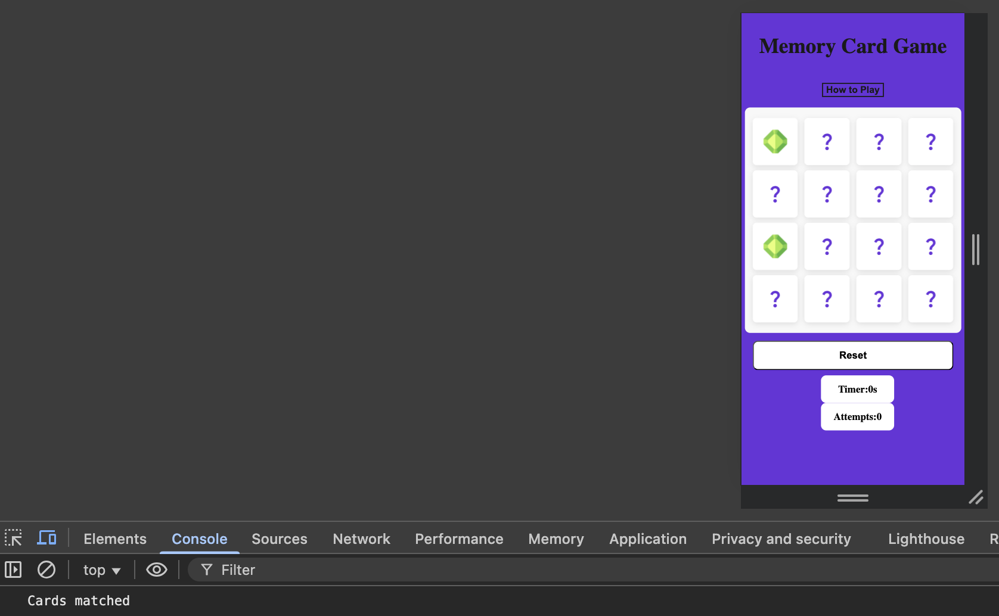
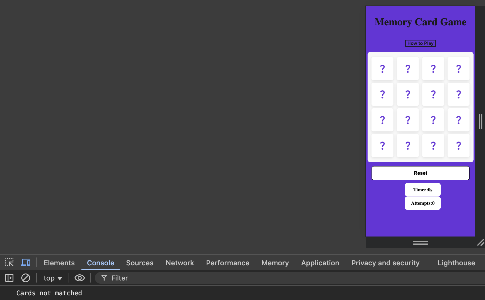

# 🃏 Memory Card Game

A simple memory card matching game built with **JavaScript**, **HTML**, and **CSS**. Players flip two cards at a time to find matching pairs. The goal is to match all pairs with the fewest moves possible.

---

## Site contents
- Main game area
- Timer & turns counter
- Modal popup with game instructions

---

## UX Design
### Overview
The memmory card game was developed with following functionality and design aspects in mind.
- Mobile-friendly, designed to be responsive so that it can be used by anyone on any device.
- Minamilistic, Site is simple and clear, easy for the user to understand what they are there for.

### Accessability 
To cater to as many people as possible this website uses different measures to be more accessible.
- clear aria labels on flipped cards with clear descriptions.
- Responsive design that changes to all screen sizes.

---

## User stories
### As a new visitor
1. I want to know what the purpose of the website is. So that I know whether it interests me.
2. I want to know how to use the game. So that i'm able to play the game prperly without any issues.
3. I want to be able to see how long i takes me to complete the game. So that I can try to progress in how quickly i complete the game.

### As the site owner 
1. I want the site to be simple and clutter free. So that visitors enjoy playing the game.

### As the developer
1. I want clear and readable code. So that the site is easy to maintain.

---

## Design choices
The following design choices were made with accessability in mind, keeping the site looking attractive as well as usable.

### Colour
The following colours have been chosen woth accessibility in mind. these colour offer a fun aesthetic for the user to help keep them engaged. 
- Jet black, (#1A1A1A) Text colour.
- Purple, (#622cd6), Background colour.
- Light grey, (#f8f8f8), Card colour.

### Fonts
Roboto, used for all text on this web page. Gives a smooth & modern feel to the website.

---

## 🎮 Features
- Flip cards to reveal hidden symbols  
- Match pairs to clear them from the board  
- Track the number of moves and time taken  
- Restart button to play again  
- Responsive design for desktop and mobile  

---

## 🛠️ Technologies Used
- **HTML5** – structure  
- **CSS3** – styling & animations  
- **JavaScript (ES6)** – game logic  

---

## Testing

The following tests have been carried out to test the websites design and responsiveness along with tests to check the site meets accessibility needs aswell as its game logic and functionality.

### Design & responsiveness

### Accessibility 
**Test:** Image `alt` attributes.  
**Method:** Reviewed all card images and their alt attributes.  
**Result (Before):** `alt` tags were generic (`card-img`) and did not describe the images.  
**Action Taken:** Updated `alt` attributes to meaningful descriptions (e.g., "blue hexagon", "purple diamond").  
**Result (After):** Screen readers now announce descriptive image names.

**Test:** On page load a pop-up modal for "how to play" appears before the game begins.  
**Issue:** Creates a barrier between the user and the game. Users had no choice but to dismmiss the pop-up.  
**Action taken:** Update the Javascript to remove the function where the modal would show on page load or refresh.  
**Result:** Modal only shows when called with "how to play" button is clicked. 

### Javascript functionaility

**Test:** Click a card to see if flip function works.  
**Result (Before):** Front of card is shown with a `question mark` symbol.  
**Expected result:** Card flips on its vertical axis to reveal the image on the back side.  
**Result:** ✅ Working (cards flip correctly).  

**Test:** Stop the same card from being clicked multiple times.  
**Result (Before):** Each card can be clicked unlimited times even when flipped.  
**Expected result:** Each card can only be clicked once, reflected in the message logged to the console.  
**Result:** ✅ Working (console log messages show that the cards are only clicked once).

**Test:** Create a function that knows when 2 cards that are clicked, either match or don't match.  
**Result (Before):** Cards would flip but there was no logic behind what was flipped, the game did not know what to look for when matching cards and did not know how to deal with unmatched cards.  
**Expected result:** When 2 cards are flipped and they are unmatched, "shake" class should be added to them, after 1.2 seconds 2 classes should be removed from those cards being "shake" & "flip" restoring the cards back to their defualt state. Matched cards remain faced forwards with the correct console.log messages respectively.  
**Result:** ✅ Working (console log messages show that cards have either been match or unmatched with correct classes being removed and addded).  
 
 "flip" class is removed in 1.2 seconds...

**Test:** Create timer function that starts on the first click and ends when all cards are matched.  
**Result (Before):** Timer is created but only starts the count once the first 2 cards are clicked rather than starting with the very first click of the game.  
**Fix:** Moved a section of code to the very top of the flipCard() function.  
**Result:** ✅ Working as planned.

### User testing

