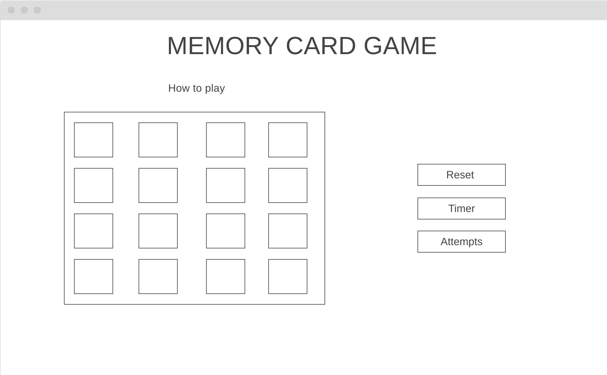
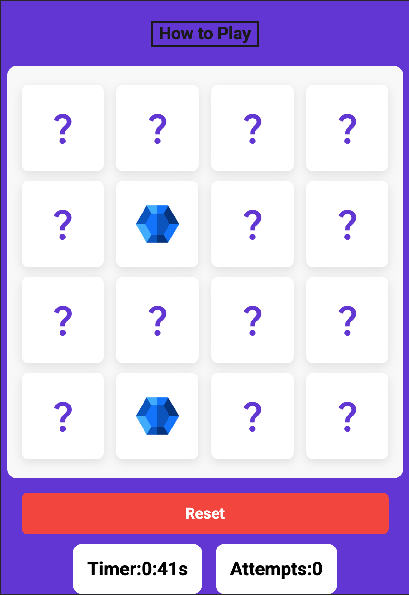

# 🃏 Memory Card Game

A simple memory card matching game built with **JavaScript**, **HTML**, and **CSS**. Players flip two cards at a time to find matching pairs. The goal is to match all pairs with the fewest moves possible.

**LIVE SITE:** https://luqmaan-io.github.io/memory-card-game/

---

## Site contents
- Main game area
- Timer & turns counter
- Modal popup with game instructions

---

## User Experience (UX)

### Strategy Plane

#### Project Goals
The purpose of this project is to create a simple, engaging, and accessible **memory card game** that users can play directly in their browser.  
The main objectives are to:
- Provide users with a fun, interactive challenge that can be completed in minutes.  
- Design a clean, responsive interface that works on all devices.  
- Encourage replayability through the inclusion of a timer and reset functionality.  

#### User Goals
The website is designed for users who:
- Want a quick and casual browser game that’s easy to understand and play.  
- Enjoy tracking their performance through time and, in future, attempts and scores.  
- Prefer a clutter-free, intuitive design that works on any screen size.  

---

### Scope Plane

#### Features Included
- **Memory Card Game:** Interactive card-flip gameplay with matching logic.  
- **Timer:** Tracks how long the user spends playing.  
- **Reset Button:** Instantly restarts the game.  
- **Modal Instructions:** “How to Play” guide that clearly explains game rules.  
- **Responsive Layout:** Works seamlessly across mobile, tablet, and desktop screens.  

#### Features Not Yet Included
The following features are planned for future updates to expand engagement and functionality:
- **Win Detection:** To recognize when all cards have been matched.  
- **End-of-Game Modal:** A pop-up displaying the user’s completion time and total attempts, with an input field to enter their name.  
- **Leaderboard System:** To save and display top times or scores from all players.  
- **Attempts Counter:** To track how many moves the player makes.  
- **Sound Effects:** To provide auditory feedback during gameplay.  
- **Difficulty Levels:** Stages that increase in challenge by adding more cards.  

---

### Structure Plane

#### Information Architecture
The website follows a simple, linear structure to maintain focus on gameplay.  
Users are immediately presented with the game interface upon loading, with optional access to the “How to Play” instructions.  
All future enhancements, such as a leaderboard or end-of-game modal, will appear as overlays rather than separate pages to maintain a smooth experience.  

#### Navigation Model
- **Main Game Area:** Core interactive section where users play.  
- **Header/Modal:** Displays game instructions when the “How to Play” button is clicked.  
- **Footer:** Displays brief information and remains fixed to the bottom of the viewport.  

---

### Skeleton Plane

#### Wireframes & Layout
The design follows a **mobile-first approach**, with a single-column layout for small screens.  


As the screen size increases:
- The **game grid** shifts slightly to the left.  
- The **controls (Reset, Timer, Attempts)** move to the right and are vertically centered beside the game.  


#### Content Priority
- **Game Board:** Main focus of the interface.  
- **Controls:** Secondary, but always visible and easily accessible.  
- **Footer:** Minimal and fixed to the bottom for consistency across all screen sizes.  

---

### Surface Plane

#### Visual Design

##### Colour Palette
The following colors were chosen to ensure good contrast and a fun, accessible look:
 - **Purple (#622CD6):** Background color, giving the site a vibrant and energetic tone.  
- **Light Grey (#F8F8F8):** Used for cards to create contrast against the background.  
- **Jet Black (#1A1A1A):** Text color for clarity and readability.  

##### Typography
- **Roboto:** Used site-wide for a clean, modern, and professional appearance.  

##### Accessibility Considerations 
- Responsive scaling across all devices.  
- High contrast between text and background for readability.  

##### Interactive Elements
To provide visual feedback and interactivity cues:
- **“How to Play” Button:** Text color transitions smoothly from black to white on hover.  
- **“Reset” Button:** Ripple effect animation on hover to emphasize interactivity.  

---

### Future UX Goals
Planned enhancements to improve engagement, accessibility and replayability:
- **Clear ARIA labels** and descriptive **alt text** for all card elements. 
- **End-of-Game Modal:** Show completion time, attempts, and allow users to enter their name.  
- **Leaderboard Integration:** Save and display top scores/times from all players.  
- **Win Detection:** Automatically detect when all pairs are matched.  
- **Difficulty Levels:** Introduce more cards for higher difficulty levels.  
- **Sound Effects:** Enhance interactivity and user feedback through audio.  

---

## 🎮 Features
- Flip cards to reveal hidden symbols  
- Match pairs to clear them from the board  
- Track the number of moves and time taken  
- Restart button to play again  
- Responsive design for desktop and mobile  


---

## Testing

**Automated testing** is when software tools or scripts are used are used to test code without manually having to click through or interact with your app yourself. These test can often give quick, relaible and repeatable checks on your code which can often save time compared to testing everything manually.

**Manual testing** is when you personally interact with your app or website to check if everything works as expected, clciking buttons, flipping cards etc helpshelps catch visual or usability issues that automated test might miss. These test give a real user's perspective on how the site behaves.

The following tests have been carried out to test the websites design and responsiveness along with tests to check the site meets accessibility needs aswell as its game logic and functionality.

### Design & responsiveness

Device and screen size test evidence

**Mobile**

The above image is the app on a mobile screen size. very simple layout and UI. Reset button, timer and attempts card stack ontop of each other below the main game area.


The above image shows the app on a tablet screen size. everything stays the same here except that the game and buttons expand slightly to take up more of the available space.


The image above is of a laptop size screen. On this device the game area moves to the left side of the screen freeing up space on the right side of the screen for the reset button and time and attempt cards to sit. These sit in the vertical centre of the game card with the reset button again stacked on top of the timer and attempts card.


### Accessibility 
**Test:** Image `alt` attributes.  
**Method:** Reviewed all card images and their alt attributes.  
**Result (Before):** `alt` tags were generic (`card-img`) and did not describe the images.  
**Action Taken:** Updated `alt` attributes to meaningful descriptions (e.g., "blue hexagon", "purple diamond").  
**Result (After):** Screen readers now announce descriptive image names.


**Test:** On page load a pop-up modal for "how to play" appears before the game begins.  
**Issue:** Creates a barrier between the user and the game. Users had no choice but to dismmiss the pop-up.  
**Action taken:** Update the Javascript to remove the function where the modal would show on page load or refresh.  
**Result:** Modal only shows when called with "how to play" button is clicked. 

### Javascript functionaility

**Test:** Click a card to see if flip function works.  
**Result (Before):** Front of card is shown with a `question mark` symbol.  
**Expected result:** Card flips on its vertical axis to reveal the image on the back side.  
**Result:** ✅ Working (cards flip correctly).  


**Test:** Stop the same card from being clicked multiple times.  
**Result (Before):** Each card can be clicked unlimited times even when flipped.  
**Expected result:** Each card can only be clicked once, reflected in the message logged to the console.  
**Result:** ✅ Working (console log messages show that the cards are only clicked once).


**Test:** Create a function that knows when 2 cards that are clicked, either match or don't match.  
**Result (Before):** Cards would flip but there was no logic behind what was flipped, the game did not know what to look for when matching cards and did not know how to deal with unmatched cards.  
**Expected result:** When 2 cards are flipped and they are unmatched, "shake" class should be added to them, after 1.2 seconds 2 classes should be removed from those cards being "shake" & "flip" restoring the cards back to their defualt state. Matched cards remain faced forwards with the correct console.log messages respectively.  
**Result:** ✅ Working (console log messages show that cards have either been match or unmatched with correct classes being removed and addded).  
 
The above image shows console message being logged once 2 cards are matched.


 
The above screenshot was taken shortly after 2 cards were flipped and they did not match, the flip class is removed after 1.2 seconds.

**Test:** Create timer function that starts on the first click and ends when all cards are matched.  
**Result (Before):** Timer is created but only starts the count once the first 2 cards are clicked rather than starting with the very first click of the game.  
**Fix:** Moved a section of code to the very top of the flipCard() function.  
**Result:** ✅ Working as planned.


### User story testing

"I want to know what the purpose of the website is. So that I know whether it interests me."  
The purpose of the website is quite intuitive as is. The "How to play" modal adds deeper explanation to this.

"I want to know how to use the game. So that i'm able to play the game prperly without any issues."  
The "how to play" button shows interactivity when hovering over it, text changes to white as well as the mouse changing to a ppointer. On clicking this a modal opens up which blurs the background to the attention is fully on the modal. This modal then breaks down to the user, how to play the game and what the outcome should be.  

"I want to be able to see how long it takes me to complete the game. So that I can try to progress in how quickly I complete the game."  
A timer has been added to the game that starts on the very first card being clicked snd flipped over. The timer runs until all cards have been matched and resets on the next game when the reset button is clicked.

---

## Deployment 

This project is built using HTML, CSS, and JavaScript, so no additional dependencies are required. It can be run locally or deployed online.

### Running Locally

1. **Clone the Repository**  
   Open a terminal and run:  
   ```bash
   git clone https://github.com/Luqmaan-io/memory-card-game.git

2. **Open in VS Code**
    Navigate to the cloned folder and open it in Visual Studio Code.

3. **Open the Application**
    Open the index.html file in your web browser to run the game locally.


### Deploying with Github Pages

1. Push your project to a GitHub repository.
 
2. Go to the repository on GitHub and click Settings.

3. Scroll down to Pages in the sidebar.

4. Under Source, select your branch (main or master) and set the folder to / (root).

5. Click Save.
GitHub will generate a live link to your site, usually:
https://your-username.github.io/your-repo-name/

---

## CSS validated using official Jigsaw validator
CSS ran through Jigsaw validator shows no errors found in the code.


## HTML validated using W3C validator
HTML validator found no errors.


## Lighthouse report


---

## 🛠️ Technologies Used
- **HTML5** – structure  
- **CSS3** – styling & animations  
- **JavaScript (ES6)** – game logic  
- **VS Code** - This web app was developed using VS code, a code editor developed by Microsoft. https://code.visualstudio.com/
- **Google Fonts** - Used to add custom typography to the site. https://fonts.google.com/
- **Favicon.io** - Used to generate the sites favicon in multiple formats. https://favicon.io/
- **ChatGPT** - Used to help debug and guide with unfamiliar css and javascript skills. https://www.chatgpt.com 

---

## Acknowledgements

Len Johnson - Tutor providing personal support and guidance when called upon. 
chatGPT - Helped with many debugging issues and questions regarding ideas that I had during development
Youtube - Tutorials on new ideas I was looking into and helped visualise things I wanted to try within this app: https://www.youtube.com/watch?v=DABkhfsBAWw&list=PLpwngcHZlPadAbdD_sFE_moH6RjgaTFCw&index=7 https://www.youtube.com/shorts/I1unAn8wgS4